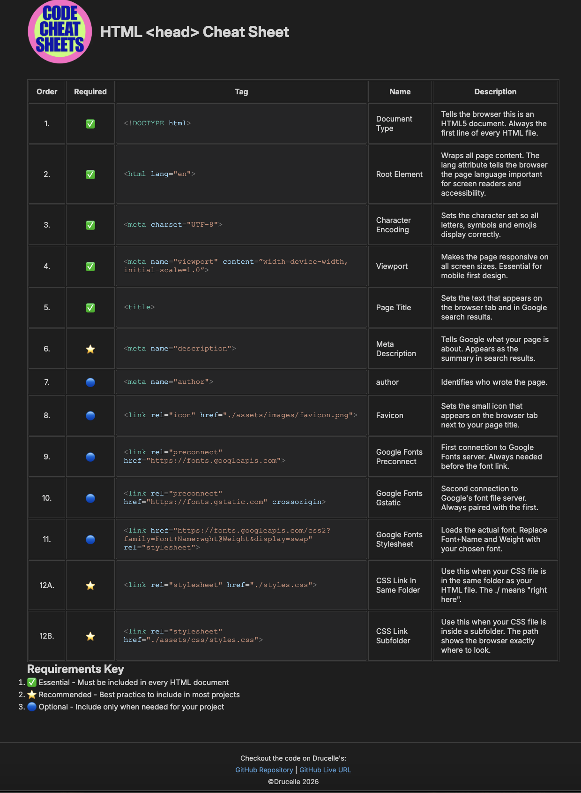

# HTML <head> Cheat Sheet

A Codecademy off-platform project, part of the Pro Full Stack Developer Course.

## Table of Contents

- [Overview](#overview)
- [Screenshot](#screenshot)
- [Links](#links)
- [My Process](#my-process)
- [Built With](#built-with)
- [What I Learned](#what-i-learned)
- [Continued Development](#continued-development)
- [Author](#author)
- [Acknowledgments](#acknowledgements)

## Overview

Great challenge that could be very useful in future as I can keep adding to it. By having to think things through onwhat you want a cheat sheet for, gives you the opportunity to go deeper in the topic of your interest. Just the exercise to think and research what is important to know is in itself a great way to learn what you need to know while adding this to your memory and understanding as you go.

## Screenshot

The task was to build a cheat sheet on any HTML or CSS topic.

I chose the HTML '<head>' element because I wanted to deeply understand what needs to be included, why each tag matters, and importantly the hierarchy order in which they should appear. These are not all the options that can be used but most importaant ones when you consider best practises.

The cheat sheet covers:
- Essential, recommended and optional head tags
- What each tag does and why it matters
- The correct order to write them in
- Syntax highlighted examples styled like VS Code

## Links

- GitHub Repo: [html-css-cheatsheet-starting](https://github.com/Drucelle/html-css-cheatsheet-starting)
- Live URL: [HTML Head Tag Cheat Sheet](https://drucelle.github.io/html-css-cheatsheet-starting/)

## My Process

### Built With

- Semantic HTML5
- CSS Custom Properties (variables)
- CSS Flexbox
- Google Fonts (Inter)
- Git & GitHub

### What I Learned

- How to build and style HTML tables
- How to use `` tags for syntax highlighting
- How to set up CSS custom properties in `:root`
- The correct hierarchy order of HTML head tags
- Terminal commands for project setup
- Git workflow from the command line

## Continued Development

I plan to build more cheat sheets covering CSS properties and Git commands.

## AI Collab

Worked with Claude AI through this project to help and guide me when I got stuck by asking questions that pointed me in the right direction. Verify my code had no typos. 

It is good to keep in mind you do need to know the basics and have a grip on best practices and understand how your project needs to be structured. So that you can ask the right questions if you use an LLM e.g. Claude and keep steering it in that dierection. I always go to documentation first. I keep testing Claude along the way to see if it contued following the "Role" I have assigned to it. Claude did not always have the right answers and had a few times that I had to point things out e.g. structures that in best practise would be done in a certain way. E.g. File Managing System Structure on VS Code when setting up was not 100%. Of course when pointed out we would be back on track rightaway

I do however enjoy working with Claude. Most of the time it helped me work faster and efficiently. Best of all I did not feel I was working alone when coding at 3 am.

## Author

- GitHub: [@Drucelle](https://github.com/Drucelle)

## Usefull Resources

- My README Template: Inspired by (https://Frontendmentor.io) course where I learned to use a README.md as best practise on GitHub. 
Read this article which explains why it's important. (https://www.frontendmentor.io/articles/the-benefits-of-writing-a-good-challenge-readme-3EIwMaYVgz) 
- To write my README.md https://www.frontendmentor.io/articles/the-benefits-of-writing-a-good-challenge-readme-3EIwMaYVgz
- For Markdown (for README.md): https://www.markdownguide.org/
- CodecCademy Full Stack Developer Course where I got this project to work on. Check them out: (https://codecademy.com)
- Canva where I made my cheap looking logo for free. Mind yoou thaaat was on purpose.😉 Check the out too: (https://canva.com)
- MDN Web Docs - A free community driven documentation library.

Disclaimer:
I'm not sponsored by anyone just a student sharing where I learned from. 
I'm still learning do make sure to do your own due diligence.

Thanks for reading my entire README.md file. Happy to hear if you got any suggestions to better the page or use better code. 😃